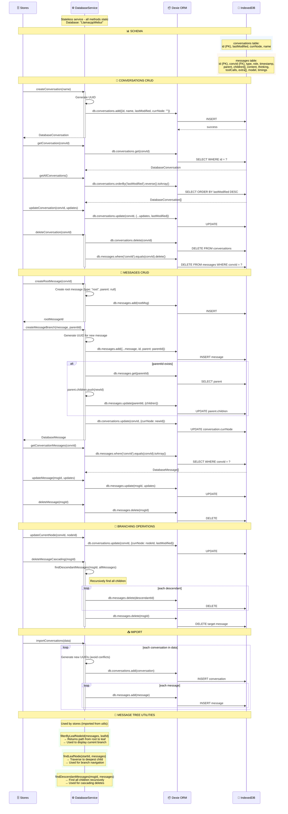

```mermaid
sequenceDiagram
    participant Store as 🗄️ Stores
    participant DbSvc as ⚙️ DatabaseService
    participant Dexie as 📦 Dexie ORM
    participant IDB as 💾 IndexedDB

    Note over DbSvc: Stateless service - all methods static<br/>Database: "LlamacppWebui"

    %% ═══════════════════════════════════════════════════════════════════════════
    Note over Store,IDB: 📊 SCHEMA
    %% ═══════════════════════════════════════════════════════════════════════════

    rect rgb(240, 248, 255)
        Note over IDB: conversations table:<br/>id (PK), lastModified, currNode, name
    end

    rect rgb(255, 248, 240)
        Note over IDB: messages table:<br/>id (PK), convId (FK), type, role, timestamp,<br/>parent, children[], content, thinking,<br/>toolCalls, extra[], model, timings
    end

    %% ═══════════════════════════════════════════════════════════════════════════
    Note over Store,IDB: 💬 CONVERSATIONS CRUD
    %% ═══════════════════════════════════════════════════════════════════════════

    Store->>DbSvc: createConversation(name)
    activate DbSvc
    DbSvc->>DbSvc: Generate UUID
    DbSvc->>Dexie: db.conversations.add({id, name, lastModified, currNode: ""})
    Dexie->>IDB: INSERT
    IDB-->>Dexie: success
    DbSvc-->>Store: DatabaseConversation
    deactivate DbSvc

    Store->>DbSvc: getConversation(convId)
    DbSvc->>Dexie: db.conversations.get(convId)
    Dexie->>IDB: SELECT WHERE id = ?
    IDB-->>DbSvc: DatabaseConversation

    Store->>DbSvc: getAllConversations()
    DbSvc->>Dexie: db.conversations.orderBy('lastModified').reverse().toArray()
    Dexie->>IDB: SELECT ORDER BY lastModified DESC
    IDB-->>DbSvc: DatabaseConversation[]

    Store->>DbSvc: updateConversation(convId, updates)
    DbSvc->>Dexie: db.conversations.update(convId, {...updates, lastModified})
    Dexie->>IDB: UPDATE

    Store->>DbSvc: deleteConversation(convId)
    activate DbSvc
    DbSvc->>Dexie: db.conversations.delete(convId)
    Dexie->>IDB: DELETE FROM conversations
    DbSvc->>Dexie: db.messages.where('convId').equals(convId).delete()
    Dexie->>IDB: DELETE FROM messages WHERE convId = ?
    deactivate DbSvc

    %% ═══════════════════════════════════════════════════════════════════════════
    Note over Store,IDB: 📝 MESSAGES CRUD
    %% ═══════════════════════════════════════════════════════════════════════════

    Store->>DbSvc: createRootMessage(convId)
    activate DbSvc
    DbSvc->>DbSvc: Create root message {type: "root", parent: null}
    DbSvc->>Dexie: db.messages.add(rootMsg)
    Dexie->>IDB: INSERT
    DbSvc-->>Store: rootMessageId
    deactivate DbSvc

    Store->>DbSvc: createMessageBranch(message, parentId)
    activate DbSvc
    DbSvc->>DbSvc: Generate UUID for new message
    DbSvc->>Dexie: db.messages.add({...message, id, parent: parentId})
    Dexie->>IDB: INSERT message

    alt parentId exists
        DbSvc->>Dexie: db.messages.get(parentId)
        Dexie->>IDB: SELECT parent
        DbSvc->>DbSvc: parent.children.push(newId)
        DbSvc->>Dexie: db.messages.update(parentId, {children})
        Dexie->>IDB: UPDATE parent.children
    end

    DbSvc->>Dexie: db.conversations.update(convId, {currNode: newId})
    Dexie->>IDB: UPDATE conversation.currNode
    DbSvc-->>Store: DatabaseMessage
    deactivate DbSvc

    Store->>DbSvc: getConversationMessages(convId)
    DbSvc->>Dexie: db.messages.where('convId').equals(convId).toArray()
    Dexie->>IDB: SELECT WHERE convId = ?
    IDB-->>DbSvc: DatabaseMessage[]

    Store->>DbSvc: updateMessage(msgId, updates)
    DbSvc->>Dexie: db.messages.update(msgId, updates)
    Dexie->>IDB: UPDATE

    Store->>DbSvc: deleteMessage(msgId)
    DbSvc->>Dexie: db.messages.delete(msgId)
    Dexie->>IDB: DELETE

    %% ═══════════════════════════════════════════════════════════════════════════
    Note over Store,IDB: 🌳 BRANCHING OPERATIONS
    %% ═══════════════════════════════════════════════════════════════════════════

    Store->>DbSvc: updateCurrentNode(convId, nodeId)
    DbSvc->>Dexie: db.conversations.update(convId, {currNode: nodeId, lastModified})
    Dexie->>IDB: UPDATE

    Store->>DbSvc: deleteMessageCascading(msgId)
    activate DbSvc
    DbSvc->>DbSvc: findDescendantMessages(msgId, allMessages)
    Note right of DbSvc: Recursively find all children
    loop each descendant
        DbSvc->>Dexie: db.messages.delete(descendantId)
        Dexie->>IDB: DELETE
    end
    DbSvc->>Dexie: db.messages.delete(msgId)
    Dexie->>IDB: DELETE target message
    deactivate DbSvc

    %% ═══════════════════════════════════════════════════════════════════════════
    Note over Store,IDB: 📥 IMPORT
    %% ═══════════════════════════════════════════════════════════════════════════

    Store->>DbSvc: importConversations(data)
    activate DbSvc
    loop each conversation in data
        DbSvc->>DbSvc: Generate new UUIDs (avoid conflicts)
        DbSvc->>Dexie: db.conversations.add(conversation)
        Dexie->>IDB: INSERT conversation
        loop each message
            DbSvc->>Dexie: db.messages.add(message)
            Dexie->>IDB: INSERT message
        end
    end
    deactivate DbSvc

    %% ═══════════════════════════════════════════════════════════════════════════
    Note over Store,IDB: 🔗 MESSAGE TREE UTILITIES
    %% ═══════════════════════════════════════════════════════════════════════════

    Note over DbSvc: Used by stores (imported from utils):

    rect rgb(240, 255, 240)
        Note over DbSvc: filterByLeafNodeId(messages, leafId)<br/>→ Returns path from root to leaf<br/>→ Used to display current branch
    end

    rect rgb(240, 255, 240)
        Note over DbSvc: findLeafNode(startId, messages)<br/>→ Traverse to deepest child<br/>→ Used for branch navigation
    end

    rect rgb(240, 255, 240)
        Note over DbSvc: findDescendantMessages(msgId, messages)<br/>→ Find all children recursively<br/>→ Used for cascading deletes
    end
```
